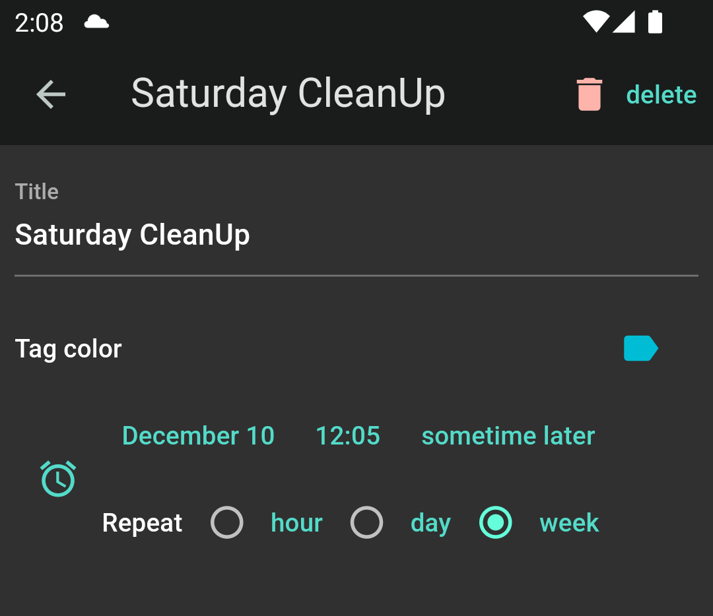

# Instruction

## Things to Note

* Each item can have **multiple tags**. For eaxmple you may want to 
buy a bunch of broccoli either at Farm Boy or Food Basics.

* Checked (completed) items do not disappear by default. They are greyed out instead.
So you don't have to recreate broccoli entry every time.

* You can set up an alarm for each item. So you will be notified to pack some
masks for tomorrow when you get home.

* You can set up an alarm for each tag. You will be notified to do series of
chores in the Saturday morning.

## Create an Item

Tap the plus icon at the bottom. Then a bottom sheet will pop up. 
So you can enter infomation about the item you want to create.

* Use comma to create multiple items at once.
* Choose as many tags as it suits your purpose
* Tap the clock icon to set up a repeatable notification alarm

{: style="width:400px"}

If you don't have tags yet, the tags do not appear. But do not worry. 
You can create those at any time.

## Edit / Delete an Item

You can edit existing items by tapping the item. A new screen will appear.
Here you can attach a note if you like

{: style="width:400px"}

In this page, you can **delete** the item or share data with other apps like email.

## Create and Use a Tag

Tap the tree-dot icon at the top right corner of the main screen and select
**Tags** menu. You can create tags or can just try a sample list.

{: style="width:400px"}

On the details page, you can change title and color of the tag. You can
set up an tag-wide alarm schedule. Or you can delete the tag.

{: style="width:400px"}

Once created, you can attach it to existing items on the items page.
You can filter the item list using the menu on the top of the front page

{: style="width:400px"}

## Questions and Answers

### I checked the item. It does not disapper

This is designed feature of the app. If you want to remove the item, head
over to the item details page by tapping the item.

### Alarm does not work

Go to phone `Settings > Apps > Nota > Notifications` and check if 
`All Nota notifications` are allowed.

## Contact US

Please [email us.](mailto:nuntium.ubique@innomatic.ca)
You can find the email link inside the app too: `About > App Info`